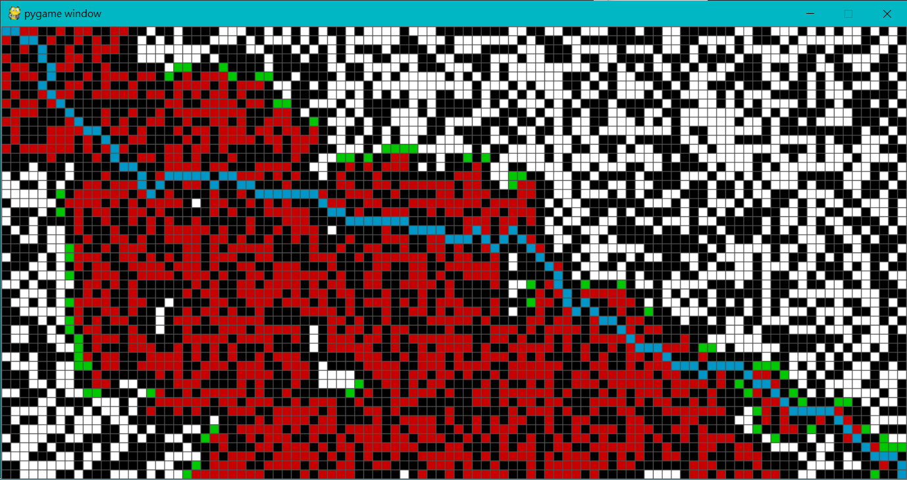
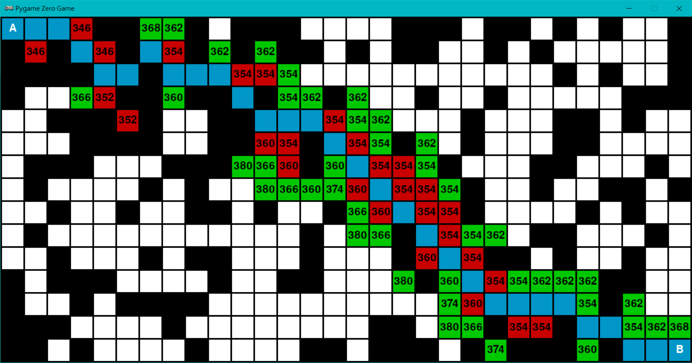

# Pathfinding
A* Path finding visualization in python. Implemented with pygame and pygame zero

## Dependency
pygame
pgzero

## Screenshots
#### pygame

Find the shortest path from top-left corner to buttom-right corner, with obstacles generated randomly.

#### pygame zero

Find the shortest path from A to B.
Basically the same as the pygame version. Added total path length (numbers shown inside each grid).
Text rendering is eaiser with pygame zero's wrappers, but the overall rendering is slower.
